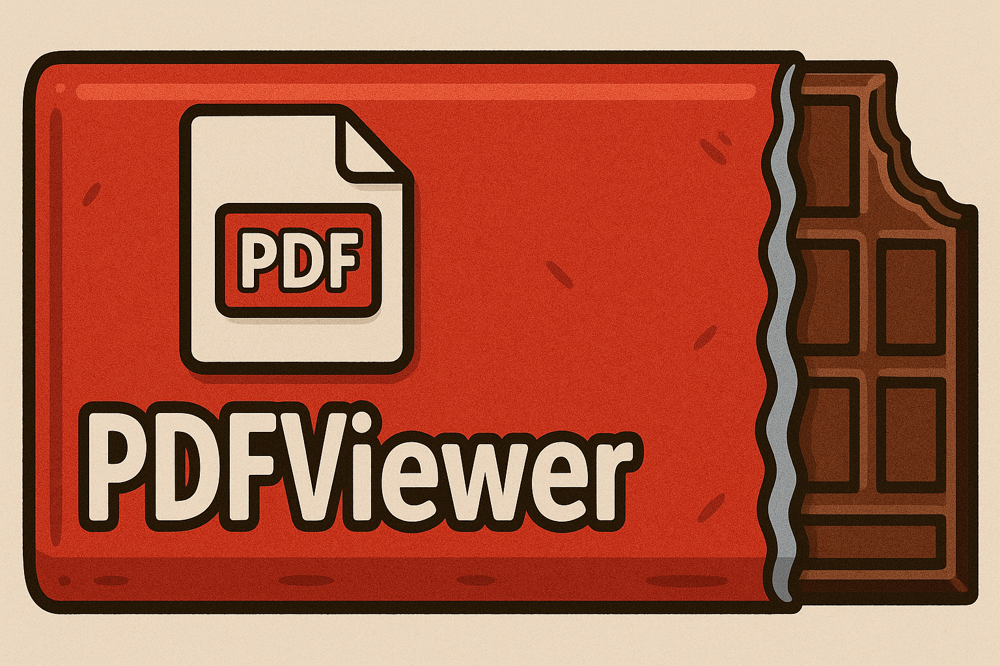

# PDFViewer
SwiftUI wrapper around `PDFKit`'s `PDFView` that brings environment-driven configuration, markup mode toggles, and per-page overlay hooks to SwiftUI apps.

## Features
- SwiftUI `PDFViewer` that hosts `PDFKit`'s `PDFView`
- Environment modifiers for display mode, direction, markup mode, and page overlays
- Builder-based `PDFConfiguration` to control scaling, background color, page breaks, shadows, and more
- Supports iOS / iPadOS 17+

## Requirements
- Swift 6.2 (swift-tools-version 6.2)
- Platforms: iOS / iPadOS 17.0+

## Installation (Swift Package Manager)
Add `PDFViewer` as a dependency in your `Package.swift`:

```swift
.dependencies: [
    .package(url: "https://github.com/DannyBehar/PDFViewer.git", from: "0.1.0")
],
.targets: [
    .target(
        name: "YourApp",
        dependencies: [
            .product(name: "PDFViewer", package: "PDFViewer")
        ]
    )
]
```

If you use Xcode, you can also add the package via **File > Add Package Dependencies…** using the repository URL.

## Usage
```swift
import SwiftUI
import PencilKit
import PDFKit
import PDFViewer

struct ContentView: View {
    private let document = PDFDocument(url: Bundle.main.url(forResource: "Sample", withExtension: "pdf")!)!

    var body: some View {
        PDFViewer(document: document)
            // PDFKit display options
            .pdfDisplayMode(.twoUpContinuous)
            .pdfDisplayDirection(.horizontal)
            .isInMarkupMode(false)
            // Configure PDFView with the builder
            .pdfConfiguration(
                PDFConfigBuilder.builder()
                    .autoScales(true)
                    .backgroundColor(.gray.opacity(0.05))
                    .displaysPageBreaks(true)
                    .pageShadowsEnabled(true)
                    .build()
            )
            // Add a custom overlay for each page
            .overlayForPage { page in
                let drawingCanvas = PKCanvasView(frame: .zero)
                drawingCanvas.tool = PKInkingTool(.pen, color: .black, width: 1)
                drawingCanvas.drawingPolicy = .pencilOnly
                drawingCanvas.overrideUserInterfaceStyle = .light
                drawingCanvas.isOpaque = false
                
                return drawingCanvas
            }
            .overlayWillFinishDisplayingForPage { page in
                // Cleanup if needed when the overlay is removed
                print("Finished displaying overlay for page: \(page.label ?? "")")
            }
    }
}
```

### Environment Modifiers
- `pdfDisplayMode(_:)` — set `PDFDisplayMode` (e.g., `.singlePage`, `.twoUpContinuous`).
- `pdfDisplayDirection(_:)` — set `PDFDisplayDirection` (`.vertical` or `.horizontal`).
- `isInMarkupMode(_:)` — toggle markup mode on the underlying `PDFView`.
- `pdfConfiguration(_:)` — pass a `PDFConfiguration` produced by `PDFConfigBuilder` or `.default`.
- `overlayForPage(_:)` — supply a `PDFPageOverlayProvider` closure returning a `UIView?` per page.
- `overlayWillFinishDisplayingForPage(_:)` — observe when an overlay stops displaying.

## Development
- Build: `swift build`
- Tests: `swift test`

## Notes
- If you want to enable page overlays, make sure you have isInMarkupMode set to true.
- `PDFConfiguration.default` uses the PDFView default options; override individual options with the builder helpers.
- The overlay callbacks run on the main actor; make sure any overlay views are lightweight for smooth scrolling.

## License
MIT License. See `LICENSE` for details.
